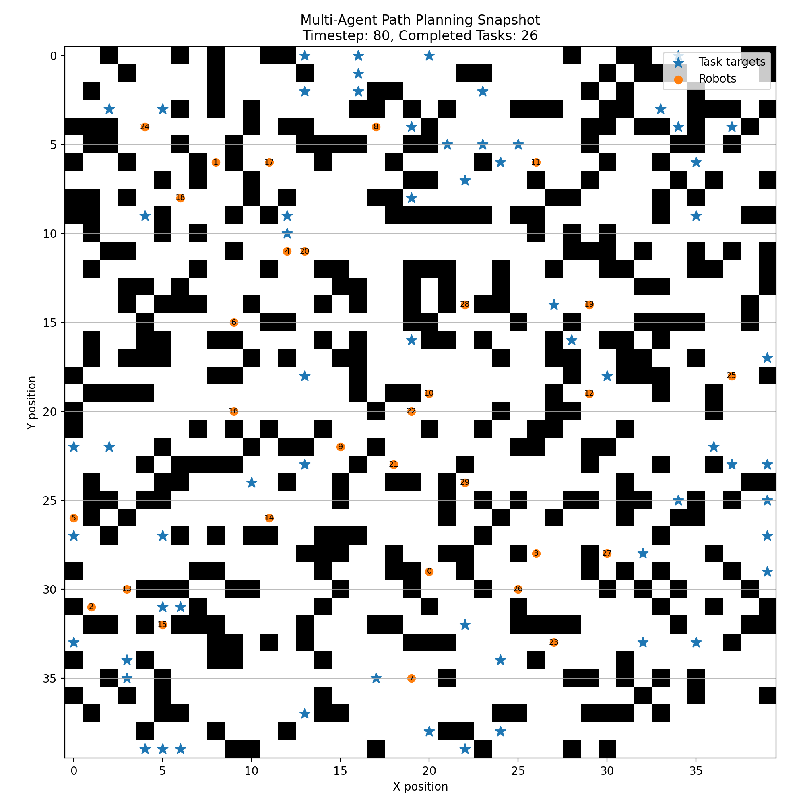

# Multi-agent-path-planning-python

This project is a Python-based multi-agent path planning simulation. It models multiple robots moving in a grid-world environment to complete dynamically assigned tasks while avoiding obstacles and robot-to-robot collisions.

## Overview

The environment contains robots, obstacles, and task targets. Each robot is assigned a task and moves toward its current target using path planning. The goal is to complete as many tasks as possible within a fixed number of timesteps.

The project combines:

- Multi-agent grid-world simulation
- Task assignment
- A* path planning
- Collision checking
- Experiment evaluation
- Simple visualization

## Features

- Grid-based environment with obstacles
- Multiple robots operating at the same time
- Dynamic task assignment
- A* search with Manhattan-distance heuristic
- Collision validation between robots
- Experiment script for performance testing
- Visualization of robots, obstacles, and task targets

## Project Structure

```text
.
├── agent.py
├── environment.py
├── run_experiment.py
├── visualize.py
├── requirements.txt
├── assets/
│   └── simulation_snapshot.png
└── README.md
```

## Algorithm

The agent uses two main steps:

1. **Task assignment**  
   Idle robots are assigned to the nearest available task using Manhattan distance.

2. **Path planning**  
   Each robot uses A* search to move toward its assigned task target while avoiding obstacles and reserved positions.

The environment checks each action before execution to prevent invalid moves and robot collisions.

## Visualization

The figure below shows a sample simulation snapshot after 80 timesteps.

- Black cells represent obstacles.
- Blue stars represent task targets.
- Orange markers represent robots.



## Experiment Results

The agent was evaluated across 10 random seeds using the following setting:

- 30 robots
- 40x40 grid
- 200 timesteps
- 30% obstacle density

| Metric | Result |
|---|---:|
| Average completed tasks | 80.70 |
| Best completed tasks | 85 |
| Average runtime | 6.34s |
| Average invalid moves | 0.00 |
| Average collision avoidances | 144.00 |
| Average forced waits | 144.00 |

The results show that the agent can complete a large number of tasks while avoiding invalid moves. Collision-related forced waits still occur, which suggests that future improvements could focus on better coordination between robots.

## How to Run

Install the required packages:

```bash
pip install -r requirements.txt
```

Run the experiment:

```bash
python run_experiment.py
```

Generate the visualization:

```bash
python visualize.py
```

## Requirements

- Python
- NumPy
- Gymnasium
- Matplotlib

## Future Improvements

- Improve coordination between robots
- Compare A* with other path planning algorithms
- Add animated simulation output
- Test different grid sizes and obstacle densities
